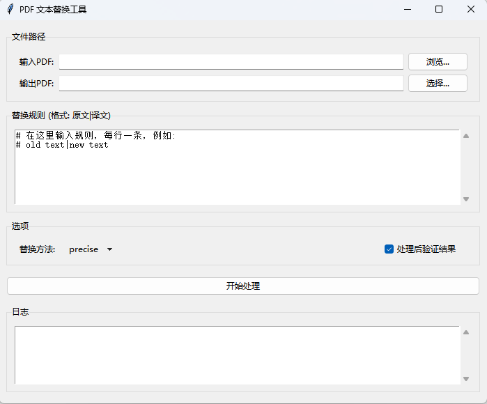

# PDF Replacer GUI

这是一个基于Python和PyMuPDF的Windows桌面应用程序，提供了一个简单易用的图形界面，用于批量替换PDF文件中的文本。

## ✨ 功能特性

- **图形化操作界面**: 无需命令行，通过直观的窗口完成所有操作。
- **动态规则编辑**: 直接在应用内文本框中添加或修改替换规则，格式为 `原文|替换文`。
- **多种替换策略**:
  - **`precise` (精确模式)**: 默认选项。尝试精确定位并替换文本，同时保留原始字体、大小和颜色。
  - **`overlay` (覆盖模式)**: 在原文本上覆盖一个白色矩形，然后写入新文本，兼容性更强。
  - **`hybrid` (混合模式)**: 自动选择最佳的替换策略。
- **支持自定义字体**: 将您的`.ttf`或`.otf`字体文件放入`fonts`文件夹，程序即可在替换时使用它们。
- **实时日志**: 在界面上实时显示处理过程、替换计数和任何潜在问题。
- **结果验证**: 可选功能，在替换完成后自动检查原文本是否还存在。
- **打包为单个.exe**: 使用PyInstaller打包，方便在没有Python环境的Windows电脑上直接运行。

## 🚀 如何使用 (最终用户)

1.  从`dist`文件夹中找到并运行 `PDF Replacer.exe`。
2.  **选择输入文件**: 点击“输入PDF”旁的“浏览...”按钮，选择您想要修改的PDF文件。
3.  **指定输出文件**: 程序会自动为您生成一个带 `_replaced` 后缀的输出文件名。您也可以点击“选择...”按钮来自定义保存路径和文件名。
4.  **填写替换规则**: 在“替换规则”文本框中，按照 `原文|替换文` 的格式输入规则，每行一条。例如：
    ```
    旧公司名称|新公司名称
    负责人A|负责人B
    ```
5.  **选择替换方法**: 从下拉菜单中选择一种替换方法（推荐使用`precise`）。
6.  **开始处理**: 点击“开始处理”按钮，程序将开始执行替换。您可以在下方的日志区域看到实时的处理进度。
7.  **完成**: 处理完成后，会弹出提示框，并且您可以在指定的输出路径找到修改后的PDF文件。


## 🛠️ 如何构建 (开发者)

如果您想从源代码运行或重新打包此应用，请遵循以下步骤。

### 1. 环境准备

- 确保您的系统已安装 Python 3.8+。
- 克隆或下载本仓库。
- 打开命令行，进入项目根目录。

### 2. 创建虚拟环境 (推荐)

```bash
# 创建虚拟环境
python -m venv .venv

# 激活虚拟环境
# Windows
.venv\Scripts\activate
# macOS/Linux
source .venv/bin/activate
```

### 3. 安装依赖

```bash
pip install -r requirements.txt
pip install pyinstaller
```

### 4. 从源码运行

```bash
python gui.py
```

### 5. 打包成EXE文件

确保您的`fonts`文件夹和自定义字体（如果需要）已放在项目根目录。然后运行以下命令：

```bash
pyinstaller --noconsole --onefile --name "PDF Replacer" --add-data "fonts;fonts" gui.py
```
- `--noconsole`: 运行exe时不显示黑色的命令行窗口。
- `--onefile`: 将所有依赖打包成一个独立的exe文件。
- `--add-data "fonts;fonts"`: 将`fonts`文件夹及其内容打包到exe中。

打包成功后，最终的可执行文件 `PDF Replacer.exe` 会出现在项目根目录下的 `dist` 文件夹中。

### 6. 命令行用法 (高级)

除了使用GUI，您也可以直接运行核心的 `pdf_replacer_pymupdf.py` 脚本，这对于自动化和批处理任务非常有用。这种方式需要一个独立的规则文件（例如 `rules.txt`）。

**命令格式:**
```bash
python pdf_replacer_pymupdf.py <input_pdf> <output_pdf> <rules_file> [--method <method>] [--verify]
```

**参数说明:**
-   `<input_pdf>`: 输入的PDF文件路径。
-   `<output_pdf>`: 输出的PDF文件路径。
-   `<rules_file>`: 包含替换规则的文本文件路径 (格式: `原文|译文`)。
-   `--method`: (可选) 替换方法，可选值为 `precise`, `overlay`, `hybrid` (默认: `precise`)。
-   `--verify`: (可选) 替换后进行验证。

**示例:**
```bash
# 使用默认的 precise 方法替换文本并验证结果
python pdf_replacer_pymupdf.py document.pdf document_updated.pdf rules.txt --verify

# 明确指定使用 overlay 方法
python pdf_replacer_pymupdf.py input.pdf output.pdf rules.txt --method overlay
```

## 📂 项目结构

```
/
├── gui.py                   # GUI界面和主逻辑 (Tkinter)
├── pdf_replacer_pymupdf.py  # 核心的PDF文本替换模块
├── requirements.txt         # Python依赖库列表
├── fonts/                   # 存放自定义字体文件 (.ttf, .otf)
│   └── LiberationSans-Bold.ttf
└── README.md                # 本说明文件
```
