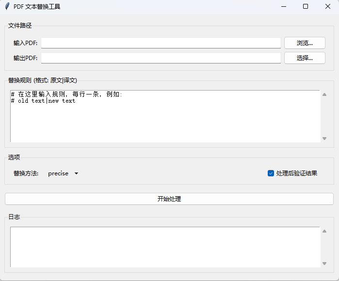

# PDF 文本替换工具 (RepliPDF)

[English](README.md) | [简体中文](README.zh-CN.md)

---

一个简单易用的Windows桌面应用，用于批量替换PDF文件中的文本。基于 Python、Tkinter 和 PyMuPDF 构建。它能帮助您轻松地查找和替换PDF文档中的文字，同时保留原有的字体和布局。



## ✨ 功能特性

- **直观的图形界面**: 提供简单的图形化操作界面，无需使用命令行。
- **动态规则编辑**: 直接在应用内按 `原文|替换文` 的格式添加、编辑或粘贴替换规则。
- **多种替换策略**:
  - **`precise` (精确模式)**: 默认选项，能准确查找并替换文本，同时保留原始的字体、大小和颜色。
  - **`overlay` (覆盖模式)**: 在原文本上覆盖一个白色矩形再写入新文本，以确保最佳的兼容性。
  - **`hybrid` (混合模式)**: 为每次替换自动选择最优策略。
- **支持自定义字体**: 只需将您的 `.ttf` 或 `.otf` 字体文件放入 `fonts` 文件夹，即可在替换时使用它们。
- **实时日志**: 实时查看替换过程、计数以及任何潜在的问题。
- **结果验证**: 可选择在处理完成后，验证旧文本是否已全部被移除。
- **独立 `.exe` 文件**: 使用 PyInstaller 打包，可在没有Python环境的Windows上运行。

## 🚀 如何使用 (最终用户)

1.  从 [Releases](https://github.com/ShawnJim/PDFTextReplacer/releases) 页面下载并运行 `PDF Replacer.exe`。
2.  **选择输入PDF**: 点击“浏览...”选择您想要修改的PDF文件。
3.  **指定输出PDF**: 程序会自动生成一个带 `_replaced` 后缀的输出路径。您也可以点击“选择...”自定义目标位置。
4.  **输入替换规则**: 在“替换规则”文本框中，按照 `原文|替换文` 的格式输入规则，每行一条。例如：
    ```
    旧公司名称|新公司名称
    负责人A|负责人B
    ```
5.  **选择方法**: 从下拉菜单中选择一种替换方法（推荐使用 `precise`）。
6.  **开始处理**: 点击“开始处理”按钮。您可以在下方的日志视图中监控进度。
7.  **完成**: 处理结束后会弹出确认消息。修改后的PDF文件会保存在您指定的输出位置。

## 🛠️ 如何构建 (开发者)

如果您想从源码运行或重新构建此应用，请按以下步骤操作。

### 1. 环境要求

- 已安装 Python 3.8+
- 已安装 Git

### 2. 克隆并设置环境

```bash
# 克隆仓库
git clone https://github.com/ShawnJim/PDFTextReplacer.git
cd PDFTextReplacer

# 创建并激活虚拟环境 (推荐)
python -m venv .venv
# Windows 系统
.venv\Scripts\activate
# macOS/Linux 系统
source .venv/bin/activate
```

### 3. 安装依赖

```bash
pip install -r requirements.txt
pip install pyinstaller
```

### 4. 从源码运行

```bash
python gui.py
```

### 5. 打包成 .exe 文件

确保 `fonts` 文件夹（以及任何自定义字体）位于项目根目录。然后，运行以下命令：

```bash
pyinstaller --noconsole --onefile --name "PDF Replacer" --add-data "fonts;fonts" gui.py
```
- `--noconsole`: 运行 .exe时不显示命令行窗口。
- `--onefile`: 将所有依赖项打包到一个可执行文件中。
- `--add-data "fonts;fonts"`: 确保 `fonts` 文件夹被包含在包中。

最终的 `PDF Replacer.exe` 文件将位于 `dist` 文件夹中。

## 命令行用法 (高级)

对于自动化或批处理任务，您可以直接从命令行使用核心脚本。这需要一个独立的规则文本文件。

**用法:**
```bash
python pdf_replacer_pymupdf.py <输入PDF> <输出PDF> <规则文件> [--method <方法>] [--verify]
```

**示例:**
```bash
# 使用默认的 'precise' 方法并验证结果
python pdf_replacer_pymupdf.py document.pdf document_updated.pdf rules.txt --verify
```

## 📄 开源许可

本项目采用 MIT 许可。详情请见 [LICENSE](LICENSE) 文件。
